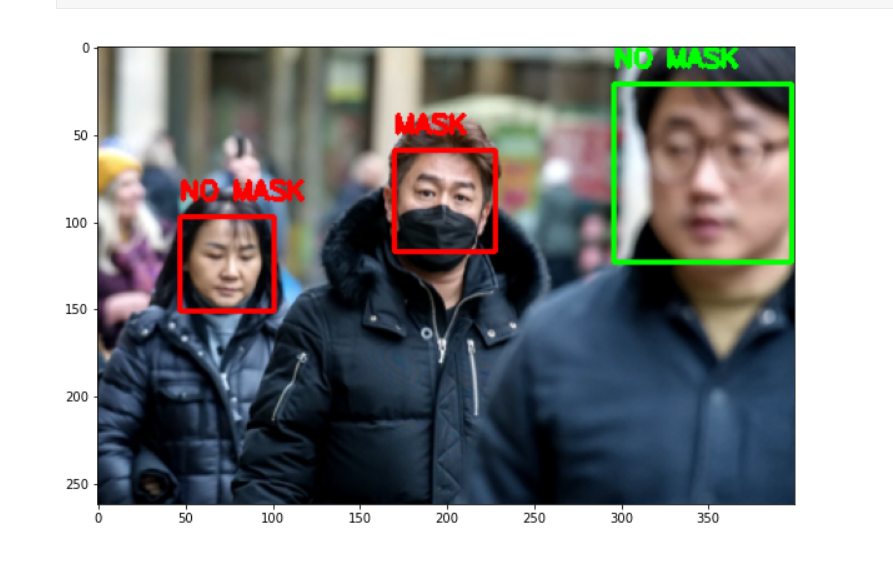

# Face-Mask-Detection-Using-MobileNET-
A deep learning model to detect face mask in images using MobileNET.  

Libraries used:  
Tensorflow  
Keras  
Numpy  
Pandas   
OpenCV  
Scipy  

Download all the datasets from below links and put then inside a folder named input inside main folder.  
https://www.kaggle.com/ashishjangra27/face-mask-12k-images-dataset  
https://www.kaggle.com/andrewmvd/face-mask-detection  
https://www.kaggle.com/gpreda/haar-cascades-for-face-detection  
https://www.kaggle.com/lalitharajesh/lbpcascade  

The output looks like:

